# Ghostwriter

**Describe what you want to publish. Ghostwriter handles the rest.**

Content creators, solopreneurs, and small teams spend 5-10 hours per article researching, writing, editing, and publishing across platforms. Most AI writing tools produce generic slop that readers immediately recognize as machine-generated.

Ghostwriter is an autonomous content engine that generates high-quality, on-brand content from real data sources — and actually sounds like you.

```
ghostwriter create "a weekly tech blog about AI safety, published to my WordPress site"
```

One command. Scheduled articles. Multiple platforms. Your voice.

---

## The Problem

| Pain point | What people do today | What Ghostwriter does |
|---|---|---|
| **Content takes forever** | 5-10 hrs/article: research, write, edit, format, publish | End-to-end pipeline runs in minutes |
| **AI writing sounds like AI** | "Delve into the ever-evolving landscape..." | 4 review agents + 93-phrase blacklist reject slop before publish |
| **Voice is inconsistent** | Manually rewrite AI output to match your tone | Style fingerprinting extracts your voice from existing writing — no fine-tuning |
| **Multi-platform is tedious** | Copy-paste and reformat for each platform | One piece adapts to blog posts, Twitter threads, and podcast scripts |
| **No feedback loop** | Guess what works, repeat what doesn't | Analytics sync feeds engagement data back into generation |

---

## How It Works

```mermaid
flowchart LR
    subgraph Input
        A["🗣️ Natural language\ndescription"] --> B["📋 Channel Config"]
        S["✍️ Your existing\nwriting samples"] --> F["🔍 Style\nFingerprint"]
    end

    subgraph Ingest["Data Ingestion"]
        B --> D["RSS Feeds\nAPIs\nWeb Scraping"]
        D --> |"cached &\ndeduped"| E["Source\nMaterial"]
    end

    subgraph Pipeline["Content Pipeline (LLM)"]
        direction TB
        E --> R["Research\n(Sonnet)"]
        R --> O["Outline\n(Sonnet)"]
        O --> DR["Draft\n(Opus)"]
        F -.->|"voice\ninjected"| DR
        P -.->|"engagement\ninsights"| DR
        DR --> RV{"4 Review\nAgents"}
        RV -->|"pass"| AD["Adapt"]
        RV -->|"fail"| PO["Polish &\nRetry"]
        PO -->|"≤3 tries"| RV
    end

    subgraph Publish["Multi-Platform Publishing"]
        AD --> WP["WordPress"]
        AD --> TW["Twitter\nThreads"]
        AD --> POD["Podcast\n(TTS)"]
    end

    subgraph Feedback["Analytics Feedback Loop"]
        WP & TW & POD --> AN["Engagement\nMetrics"]
        AN --> P["Performance\nInsights"]
    end

    style Input fill:#f0f4ff,stroke:#4a6fa5
    style Ingest fill:#fff4e6,stroke:#c48a2a
    style Pipeline fill:#f0fff4,stroke:#3a8a5c
    style Publish fill:#fff0f0,stroke:#a54a4a
    style Feedback fill:#f5f0ff,stroke:#6a4aa5
```



### The pipeline in plain English:

1. **You describe a channel** — topic, tone, audience, schedule, platforms
2. **Ghostwriter ingests real data** — RSS feeds, market APIs, recipe databases — cached and deduplicated
3. **Research stage** synthesizes sources into key facts, data points, and narrative angles
4. **Outline stage** structures the piece with sections and assigned evidence
5. **Draft stage** writes the full article using your style fingerprint, persona, and past performance insights
6. **4 review agents score independently** — editing, fact-checking, engagement, and AI detection — each enforcing minimum quality thresholds
7. **Polish loop** revises and re-reviews up to 3 times; content that can't pass the quality gate is never published
8. **Adapt stage** fans out to platform-native formats (Markdown for blogs, threaded tweets, podcast scripts with TTS)
9. **Analytics sync** pulls engagement metrics back in, so the next run learns from what resonated

---

## Quality: The Anti-Slop Stack

Most AI content fails because there's no quality gate between generation and publish. Ghostwriter's review layer is the core differentiator:

- **93-phrase blacklist** — "delve", "it's important to note", "in today's rapidly evolving landscape", and 90 more are hard-rejected
- **4 parallel review agents** — Editor (structure, readability, voice match), Fact Checker (accuracy, source coverage), Engagement (hook strength, reader pull-through), AI Detection (naturalness, sentence-length variance, burstiness)
- **9 scored dimensions** with configurable minimums per channel
- **Revise-or-reject loop** — fails get polished and re-reviewed up to 3 times. If it still doesn't pass, it goes to a dead-letter queue instead of your audience

---

## Style Fingerprinting

Point Ghostwriter at your best writing and it extracts a quantitative style profile — no LLM calls, no fine-tuning, zero cost:

```bash
ghostwriter fingerprint https://your-blog.com/favorite-post
```

What it captures: sentence length distribution, paragraph variation, contraction frequency, formality, vocabulary patterns, use of headings/lists, greeting and signoff style, top n-grams. This profile is injected into the draft prompt so generated content matches your voice.

---

## Install

```bash
npm install -g @npow/ghostwriter
```

## Quick Start

**Prerequisites:** Node.js >= 22, pnpm, Docker (for Postgres + Redis + Temporal)

```bash
# Clone and install
git clone https://github.com/npow/ghostwriter.git && cd ghostwriter
pnpm install

# Start infrastructure
docker compose up -d

# Configure
cp .env.example .env
# Edit .env with your API keys (at minimum: ANTHROPIC_API_KEY)

# Build
pnpm turbo build

# Connect a publishing platform
ghostwriter connect wordpress-com   # OAuth flow — opens browser
ghostwriter connect wordpress       # Self-hosted — Application Passwords
ghostwriter connect twitter

# Create a channel from a description
ghostwriter create "a daily recipe blog with Mediterranean focus"

# Or scaffold manually
ghostwriter init my-channel
ghostwriter validate my-channel
ghostwriter run my-channel
```

---

## Example Channels

Ghostwriter ships with three example channels to show the range:

| Channel | What it does | Data sources | Platforms | Schedule |
|---|---|---|---|---|
| **Easy Weeknight Meals** | 30-min recipe blog in a casual parent's voice | Spoonacular API, Budget Bytes RSS | WordPress | Tue/Thu 9am |
| **Tech Digest Podcast** | 5-min daily tech news recap, skeptical tone | Hacker News, TechCrunch, The Verge RSS | Podcast (Buzzsprout) + Twitter | Weekdays 7am |
| **Weekly Stock Recap** | S&P 500 analysis, no-jargon style | Polygon API, Yahoo Finance RSS | WordPress + Twitter | Sat 10am |

Each channel config defines voice (persona, opinions, verbal tics, vocabulary), data sources, quality thresholds, and publish targets — all in one YAML file.

---

## Architecture

Monorepo with 10 packages, orchestrated by [Turborepo](https://turbo.build/) and [Temporal](https://temporal.io/).

```
packages/
  core/                 # Schemas, config, logger, anti-slop blacklist, connections store
  cli/                  # Commander-based CLI (create, connect, run, fingerprint, ...)
  data-ingestion/       # RSS feeds, APIs (Polygon, Spoonacular), caching & dedup
  style-fingerprint/    # Writing style extraction — pure computation, no LLM
  content-pipeline/     # Multi-stage LLM pipeline: research → outline → draft → review
  publishing/           # Platform adapters: WordPress, Twitter, Buzzsprout podcasts
  site-setup/           # WordPress.com site provisioning + OAuth
  database/             # Drizzle ORM + PostgreSQL (channels, runs, artifacts, publications)
  orchestrator/         # Temporal workflows for scheduled content generation
  monitoring/           # Analytics sync, performance insights, engagement feedback
```

---

## Environment Variables

See [`.env.example`](.env.example) for the full list. The only required key to get started is `ANTHROPIC_API_KEY`.

## Development

```bash
pnpm turbo build       # Build all packages
pnpm turbo test        # Run tests
pnpm turbo dev         # Watch mode
```

## Install from npm

```bash
npm install -g @npow/ghostwriter
ghostwriter create "a weekly tech blog about AI safety"
```

## License

MIT
